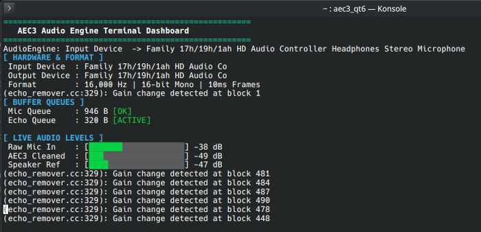

# WebRTC AEC3 fully working using Qt6 Audio


It uses slightly modified [AEC3 Extracted From WebRTC](https://github.com/ewan-xu/AEC3)



### Prerequisites
Ensure you have the following installed on your system:
- **C++20 Compiler** (GCC 10+, Clang 11+)
- **CMake 3.16+**
- **Qt 6.x** (Core & Multimedia modules)

### Build & Run
```bash
git clone https://github.com/khomin/webrtc_aec3_qt6_cmake.git --recurse-submodules
cd ./webrtc_aec3_qt6_cmake
mkdir build && cd ./build

# Configure and build
cmake -B build
cmake --build build -j$(nproc 2>/dev/null || sysctl -n hw.ncpu)

# Run
./build/aec3_qt6
```

### Troubleshooting

If CMake fails with an error like:
 'Could not find a package configuration file provided by "QT" with any of'

Add prefix path to your Qt before cmake ../<br/>example
```bash
export CMAKE_PREFIX_PATH=~/Qt/6.x.x/macos
```

## License
MIT
